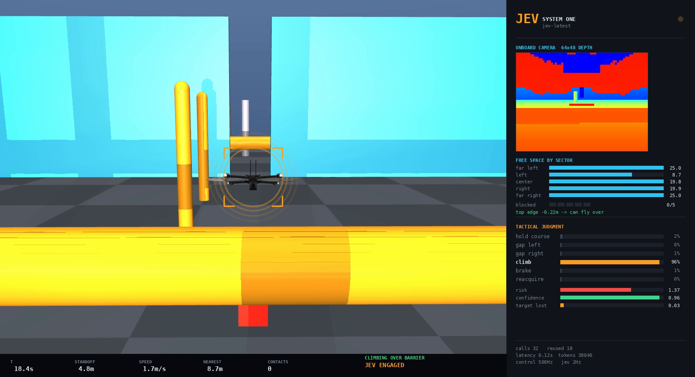
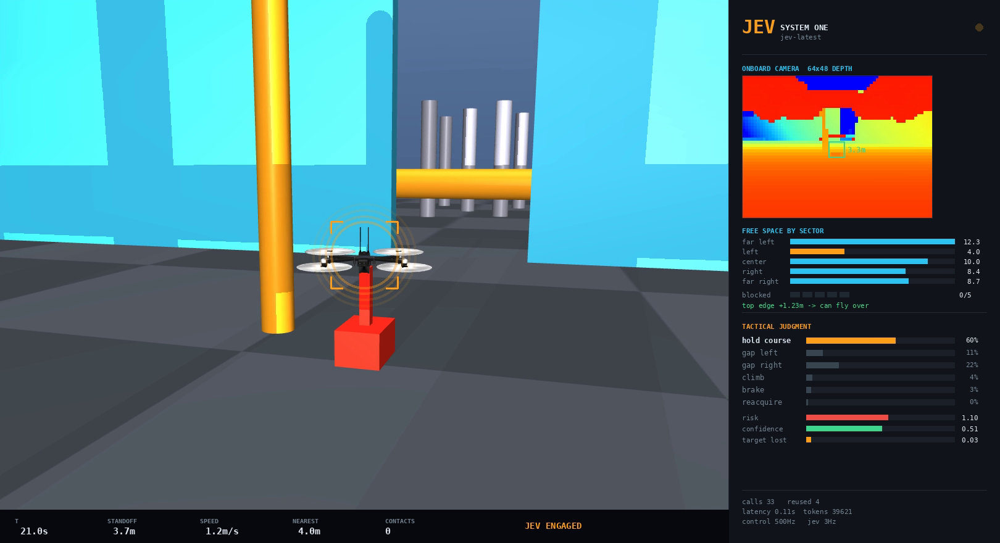

# jev-drone

An autonomous quadrotor flies a five-station obstacle course in MuJoCo using
**only its onboard camera**. A small judgment model ([TypeSafe](https://typesafe.ai)'s
Jev) sits at ~2.5 Hz and decides *what the situation means*; everything
time-critical stays in ordinary code.



The drone is the Skydio X2 from [MuJoCo Menagerie](https://github.com/google-deepmind/mujoco_menagerie)
- a real airframe with four rotors, flown by a geometric controller. Nothing
about the flight is scripted.

## The idea

Jev is **not** a vision model. It takes JSON and returns typed answers with
probabilities. So it cannot be the perception layer, and it cannot run at
control rate. What it can do is answer small questions about a situation that
ordinary code finds hard to phrase.

```
 500 Hz   geometric controller       flight.Pilot    thrust-priority mixing, slew-limited
  50 Hz   guidance + safety reflex   run.Guidance    ALWAYS owns safety
  15 Hz   camera -> symbolic scene   flight.Eye      depth + segmentation, no ground truth
~2.5 Hz   tactical judgment          tactics.py      Jev, advisory only
```

Classical CV turns the depth and segmentation buffers into a compact scene:
five forward range sectors, the height of whatever is blocking the path,
whether its top edge is even visible, and where the target is. Jev reads that
and answers three questions in one call:

| question | type | options |
|---|---|---|
| `maneuver` | **Choice** | hold_course / gap_left / gap_right / climb / brake / reacquire |
| `risk` | **Score** | clear and open -> tight -> about to hit something |
| `target_truly_lost` | **Noul** | genuinely lost, or just briefly occluded? |

Code decides *when* to ask. On an open corridor with the target in view there
is nothing to decide, so no call is made. Scenes are fingerprinted so an
unchanged situation reuses the last judgment. A typical 65 s flight costs about
110 calls.

**Code keeps the veto.** A hard reflex layer runs at 50 Hz and overrides any
judgment when something is close. Jev can propose `climb`, but code refuses it
unless the obstruction's measured top edge is actually within the aircraft's
climb ceiling.

## The course

Five stations, each breaking a different assumption:

1. **Slalom** - ordinary steering around pillars
2. **Low beam** - spans the whole corridor. No lateral gap exists at any width, so "go around" is not available. It must be flown *over*.
3. **Turnstiles** - arms sweeping across the lane. Moving, must be timed.
4. **Sliding gate** - a 3.2 m gap that slides sideways. Too tall to climb, so it must be threaded.
5. **Cluster** - dense pillars



## Results

The ablation is the same stack with the Jev call disabled, falling back to a
greedy "steer toward the wider side" heuristic. That baseline is *safe but
stuck*: it never crashes and it never gets past station 2, because going over
an obstacle is not something it can express.

| | baseline (no Jev) | Jev engaged |
|---|---|---|
| furthest point reached | 17.7 / 17.7 / 17.7 m | **77.5 m (whole course)** |
| target kept in view | ~19% | **82%** |
| time pinned in reflex | 65-71% | **9%** |
| collisions | 0 / 0 / 0 | **0** |

The baseline stops dead at station 2 every single time. With Jev the drone
clears the entire course in about 47 s at up to 3.6 m/s:

```
x=19  beam0       t=15.7  z=3.0   climbed over
x=26  turnstiles  t=20.3  z=1.6   timed the sweeping arms
x=38  GATE        t=31.3  z=1.6   threaded the sliding 3.2 m gap
x=44  beam1       t=36.8  z=2.8   climbed over
x=50  cluster     t=41.3  z=1.6   lost the rover in the pillars
x=58  exit        t=46.6          re-acquired it and closed back to 3.7 m
```


80 calls over 65 s, 0.11 s median latency, 96k tokens.

The cluster is worth noting: the drone genuinely loses the rover there, flies to
where it estimates the rover has got to, and picks it back up. That recovery is
the difference between a demo and a system.

**Honest caveats.** The Jev column is a single 65 s run, not a seed-matched
average. On an earlier, simpler arena a matched 3-seed comparison showed **no
advantage** for Jev (it crossed 0/3, same as baseline) - the extra maneuvering
cost target visibility. Run-to-run variance is large. The claim this repo
supports is narrow and specific: *the baseline is structurally incapable of the
maneuver, and Jev supplies it.* It is not "the model makes the drone better at
everything".

### What is and is not the model

Worth being precise, because it is easy to overclaim:

| layer | who does it | rate |
|---|---|---|
| **Awareness** - what is out there, how far, where is the target | numpy on depth + segmentation. **Zero Jev.** | 15 Hz |
| Flight control - attitude, thrust, mixing | geometric controller. **Zero Jev.** | 500 Hz |
| Safety reflex - do not hit that | code, and it **overrides** Jev | 50 Hz |
| **Tactical choice** - over it? around it? which side? is it lost? | **100% Jev** | ~3 Hz |

Code decides *what is there*; Jev decides *what to do about it*. Jev cannot see
- it takes JSON, not pixels. The defensible claim is "a judgment model in a
live control loop at 3 Hz with 0.11 s median latency", not "the model does the
perception".

### The judgments themselves are good

On hand-built scenes, 6 of 7 correct with strong probabilities:

```
LOW BARRIER, all 5 blocked, top 0.45m  -> climb        p=0.93  risk=1.42
TALL PILLAR ahead, right wide open     -> gap_right    p=0.72  risk=1.53
TALL PILLAR ahead, left wide open      -> gap_left     p=0.40  risk=1.58
TARGET GONE 7s, wide open              -> reacquire    p=0.96  lost=0.85
BOXED IN, close on all sides, tall     -> brake        p=0.84  risk=1.89
ALL CLEAR, target dead ahead           -> hold_course  p=0.82  risk=0.46
BRIEF OCCLUSION 0.6s, path clear       -> (muddy, p=0.24)      lost=0.12
```

The one muddy case is instructive: the **Choice** was unconfident, but the
**Noul** answered it cleanly (`target_truly_lost=0.12`). So the search
behaviour is gated on the Noul, not on the Choice. Use the primitive that
actually fits the question.

### The state has to contain the answer

Jev initially refused to ever pick `climb`. That was correct. The state was
five horizontal range sectors - it contained no vertical information at all, so
"fly over it" was not an inferable option. Adding the obstruction's top-edge
height, whether that top edge is visible to the camera, and the aircraft's own
climb ceiling moved `climb` from never-chosen to p=0.93.

That was a state-design bug, not a model failure. It is the single most useful
thing this project taught.

## Run it

```bash
./setup.sh                      # venv + fetch the Skydio X2 model
cp .env.example .env            # then put your key in it
```

```bash
set -a && . ./.env && set +a
export MUJOCO_GL=glfw           # or egl on a headless box

.venv/bin/python run.py --seconds 65 --seeds 1              # Jev engaged
.venv/bin/python run.py --no-jev --fast --seconds 65 --seeds 0 1 2   # ablation (free)
.venv/bin/python run.py --seconds 65 --seeds 1 --video course.mp4    # + telemetry video
TRACE=1 .venv/bin/python run.py --seconds 65 --seeds 1      # print every judgment
```

A video run also writes `course.mp4.tape.npy`. Re-cut the visuals from that
without flying again, and without spending any API credits:

```bash
.venv/bin/python replay.py course.mp4.tape.npy out.mp4 --from 12 --to 30
```

Every knob a human should review lives at the top of `tactics.py`: the three
questions, the option rubrics, and every threshold that changes how the
aircraft reacts to a judgment.

## Layout

| file | what it is |
|---|---|
| `world.xml` | the arena and the five stations |
| `flight.py` | controller + camera-to-scene perception |
| `run.py` | guidance, safety reflex, episode loop, metrics |
| `tactics.py` | **everything Jev-facing**: questions, rubrics, thresholds |
| `hud.py` | telemetry overlay |
| `replay.py` | re-render a recorded flight, no physics, no API calls |

## Simulator bugs worth stealing

Most of the work was the simulator and the controller, not the model. These all
cost real time:

- MuJoCo's `map znear/zfar` are **fractions of `stat.extent`**, not metres. In a
  40 m arena `znear=0.05` blinded the drone inside 1.93 m, so the safety reflex
  never once fired.
- Image-right is **-y** for a camera looking down +x, so the target bearing sign
  was inverted and the yaw loop became positive feedback: the drone turned
  *away* from what it was chasing.
- The camera sits inside the airframe, so the drone saw **its own body** as an
  obstacle at 3.94 m until own-body geoms were masked out.
- The target's mast is a separate geom from its hull. Identifying the target by
  geom instead of by body made the drone avoid its own target.
- Clipping negative motor commands destroys thrust *and* torque together.
  Thrust-priority mixing plus a slew-limited velocity command took peak tilt
  from 84 deg (tumble, unrecoverable) to a 40 deg transient.
- Anything you have already climbed over is not a threat. Obstacle pixels have
  to be filtered by height relative to the aircraft, or the reflex shoves you
  back off the wall you just cleared.
- **The geometric attitude controller cannot recover from inverted flight, by
  construction.** Its error term `eR = 0.5*vee(Rd^T R - R^T Rd)` has magnitude
  proportional to **sin(theta)**: it peaks at 90 deg and falls to *zero* at 180 deg,
  so an upside-down aircraft sits at a stationary point with no restoring torque.
  That is the 179-degree lawn-dart. Swapping it for a quaternion error (magnitude
  `sin(theta/2)`, monotonic all the way to 180 deg) gives maximal righting torque
  exactly when it is needed most - verified recovering from 179 deg. This one fix
  also took the obstacle course from 77 m to 88 m.
- **A quadrotor cannot thrust downward, and the controller has to know that.** On a
  hard commanded descent `a_z + G` goes negative, so the desired thrust axis
  `b3 = a_des/|a_des|` points at the floor and the controller faithfully commands an
  INVERTED attitude. The aircraft flips, drops into attitude recovery (which zeroes
  horizontal acceleration) and then drifts sideways with no lateral control at all -
  while the navigator is still correctly calling for a dodge. Clamping `a_des[2]`
  positive was worth more than every gain-tuning attempt combined.
- **Lateral control needs a POSITION loop, not a velocity command.** Commanding a
  lateral velocity and holding it until the next judgment gives the aircraft no notion
  of where to stop: it crosses the whole corridor and buries itself in the far wall.
  And the position it servos to has to be *estimated*: the wall measurement vanishes
  exactly when it matters (an obstacle fills the view), and a naive "assume centred"
  fallback had the aircraft convinced it was mid-tunnel while pinned against a wall at
  y=+5.5 m. Dead-reckon laterally and correct only on plausible wall readings: 0.07 m
  median error against ground truth.
- **A lost target needs a world-frame estimate, not a bearing.** A camera
  bearing is meaningless the moment the target leaves frame, so the drone swept
  blindly around a stale heading and sat still while the rover drove away. Fix:
  convert bearing+range+own pose into a world position, carry it forward with the
  observed velocity, and fly there. Measured against ground truth the estimate is
  good to 0.14 m and 0.12 m/s - and it must be differentiated over ~1 s, because
  over one 0.07 s camera frame pixel noise becomes tens of m/s and the drone
  extrapolates itself off the map.
- **A reflex must brake for what is in your path, not what is beside you.** Using
  the nearest obstacle across the whole forward cone meant walls 1.2 m to either
  side triggered a permanent brake, so any gap narrower than 2x the reflex radius
  was physically impossible to enter. The gate was not hard, it was forbidden.
  Splitting out `path_ahead_m` (the middle sectors only) fixed it.
- A wide lens helps you *see* the target but ruins threat assessment, because
  things 60 deg off the nose were never in the way. Separate the tracking FOV
  from the threat cone.
- Re-applying a heading correction at 50 Hz off a 15 Hz camera applies the same
  error three times and spins the aircraft. Latch an absolute setpoint per
  camera frame.
- **Sim time is not wall-clock time.** The sim ran 10x real time, so 152 of 182
  judgment requests hit a full queue and the model influenced nothing. If you
  are putting a network call in a control loop, pace the sim to real time or you
  are not testing anything.

## The tunnel experiment (`tunnel.py`) - partial

A separate, harder setup: a 620 m enclosed tunnel, 15 obstacles, chasing a car,
with **Jev as the only navigator** - no reflex and no hand-written avoidance at
all. Two graded `Score` questions ("how hard to steer, and which way", "should it
change height") map straight onto the control command, so the answer *is* the
steering signal rather than a label to act on.

Measured throughput, live in a 500 Hz control loop:

| | |
|---|---|
| decision latency | **0.118 s** median, 0.164 s p90 |
| sequential ceiling | 7.4 Hz |
| pipelined (4-6 workers) | **21 decisions/s sustained**, zero errors in ~2000 calls |

**The honest reaction budget at 9 m/s**: perception 0.03 s, Jev 0.118 s, decision
age 0.024 s, and the **airframe 0.70 s to translate 2 m sideways**. The model is
13% of the loop; the vehicle is 80%. Making the decisions faster cannot help, and
commanding the airframe harder is what makes it tumble.

Status: the aircraft is now stable (flies full episodes, never hits the floor,
recovers from >90 deg), and in the best runs it dodged with **zero collisions and
94% target visibility**. But it does not reliably clear the whole tunnel - it
tends to over-commit a dodge and end up against a wall. This is written up as a
partial result, not a working system.

## License

MIT. The Skydio X2 model comes from MuJoCo Menagerie under its own license.
